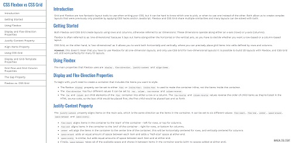

This mini project was made as part of the [freeCodeCamp](https://www.freecodecamp.org/learn/) Responsive Web Design certification course. 

The brief was to build a [CodePen.io](codepen.io) Technical Documentation Page app that is functionally similar to this: https://codepen.io/freeCodeCamp/full/NdrKKL.

For this project, I chose to write documentation comparing Flexbox and CSS Grid, as I recently studied these as part of the Responsive Web Design course. 

My original CodePen can be viewed [here](https://codepen.io/nickchapman1988/pen/LYQNKVM)

As part of the project brief, several user stories were specified to be met. These were as follows:

<table>
    <tr>
    <th>STORY ID</th>
    <th>USER STORY</th>
    </tr>
    <tr>
    <td>User Story #1:</td>
    <td>I can see a main element with a corresponding <code>id="main-doc"</code>, which contains the page's main content (technical documentation).</td>
    </tr>
    <tr>
    <td>User Story #2:</td>
    <td> Within the <code>#main-doc</code> element, I can see several section elements, each with a class of main-section. There should be a minimum of 5.</td>
    </tr>
    <tr>
    <td>User Story #3:</td>
    <td>The first element within each <code>.main-section</code> should be a header element which contains text that describes the topic of that section.</td>
    </tr>
    <tr>
    <td>User Story #4:</td>
    <td>Each section element with the class of main-section should also have an id that corresponds with the text of each header contained within it. Any spaces should be replaced with underscores (e.g. The section that contains the header "JavaScript and Java" should have a corresponding id="JavaScript_and_Java").</td>
    </tr>
    <tr>
    <td>User Story #5:</td>
    <td>The <code>.main-section</code> elements should contain at least 10 <code>p</code> elements total (not each).</td>
    </tr>
    <tr>
    <td>User Story #6:</td>
    <td>The <code>.main-section</code> elements should contain at least 5 <code>code</code> elements total (not each).</td>
    </tr>
    <tr>
    <td>User Story #7:</td>
    <td>The <code>.main-section</code> elements should contain at least 5 <code>li</code> items total (not each).</td>
    </tr>
    <tr>
    <td>User Story #8:</td>
    <td> I can see a <code>nav</code> element with a corresponding <code>id="navbar"</code>.</td>
    </tr>
    <tr>
    <td>User Story #9:</td>
    <td>The <code>navbar</code> element should contain one <code>header</code> element which contains text that describes the topic of the technical documentation.</td>
    </tr>
    <tr>
    <td>User Story #10:</td>
    <td>Additionally, the <code>navbar</code> should contain link (<code>a</code>) elements with the class of nav-link. There should be one for every element with the class main-section.</td>
    </tr>
    <tr>
    <td>User Story #11:</td>
    <td>The <code>header</code> element in the navbar must come before any link (<code>a</code>) elements in the navbar.</td>
    </tr>
    <tr>
    <td>User Story #12:</td>
    <td>Each element with the class of nav-link should contain text that corresponds to the header text within each section (e.g. if you have a "Hello world" section/header, your navbar should have an element which contains the text "Hello world").</td>
    </tr>
    <tr>
    <td>User Story #13:</td>
    <td>When I click on a navbar element, the page should navigate to the corresponding section of the main-doc element (e.g. If I click on a nav-link element that contains the text "Hello world", the page navigates to a section element that has that id and contains the corresponding header.</td>
    </tr>
    <tr>
    <td>User Story #14:</td>
    <td>On regular sized devices (laptops, desktops), the element with id="navbar" should be shown on the left side of the screen and should always be visible to the user.</td>
    </tr>
    <tr>
    <td>User Story #15:</td>
    <td>My Technical Documentation page should use at least one media query.</td>
    </tr>
</table> 